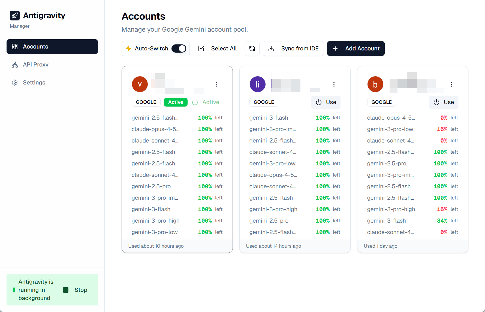
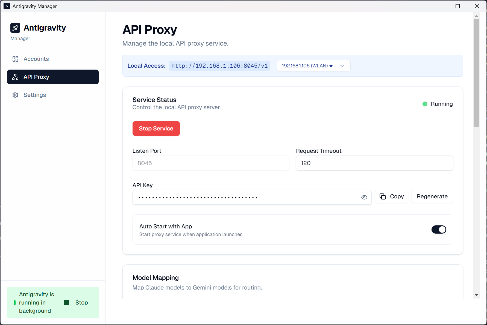
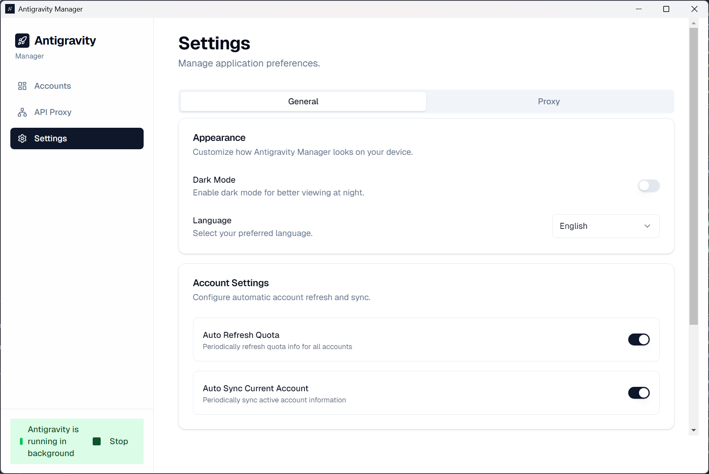

<p align="center">
  
</p>

# AGATE (Antigravity Helper)

<p>
  <strong>A Professional Multi-Account Management Suite and Local Proxy Layer for Google Gemini & Claude AI.</strong>
</p>

<p>
  
  
  
  
</p>

---

## Abstract

When deeply integrating advanced AI models into continuous deployment pipelines or heavy workloads, engineers frequently confront significant limitations: single-account quota walls, chaotic session management across disparate providers, zero visibility into rate limits, and fractured local testing environments.

**AGATE (Antigravity Helper)** is constructed explicitly to engineer around these bottlenecks. Deployed as a secure, streamlined Electron desktop environment, AGATE serves as a robust orchestration proxy—unifying session management and guaranteeing high-availability for your AI integrations.

---

## Core Architecture

- **Infinite Identity Pooling:** Provision and index an unrestricted volume of Google Gemini and Claude accounts.
- **Intelligent Workload Balancing:** The local proxy dynamically evaluates rate limits and exhaustion thresholds across the pool, seamlessly failing over to secondary sessions without halting operational workflows.
- **Live Telemetry & Diagnostics:** Monitor precise usage metrics, session states, and account health via a comprehensive visual dashboard.
- **OpenAPI Compliant Local Server:** Boot straight into a local proxy sandbox that natively adheres to standard OpenAI and Anthropic endpoint specifications.
- **Enterprise-Grade Security:** Sensitive keys and session tokens are locked behind AES-256-GCM encryption, managed natively by your local operating system's credential infrastructure.

---

## Technical Features

### Cloud Identity Handling
- Scalable session persistence for an unlimited array of Gemini and Claude profiles.
- Detailed indexing of account activity states, historic access metadata, and core user profile information.
- Reactive health monitoring detecting Active, Rate Limited, and Expired token states in real-time.

### Diagnostics Dashboard
- Complete compatibility tracking for varied foundational models (e.g., `gemini-pro`, `claude-3-5-sonnet`).
- Data-dense visual progress tracking for quota saturation.
- Support for rapid, asynchronous manual and scheduled status polling.

### Automated Routing Engine
- 'Unlimited Pool Mode' algorithmically distributes execution weight across standby accounts.
- Pre-emptive failover logic diverts traffic instantly when an active token dips below a 5% quota baseline.
- Configurable health-check loops executed strictly in the background.

### Local Development Proxy
- Host an agile intercept proxy mirroring industry-standard REST specifications (OpenAI / Anthropic).
- Deep configuration of timeout windows, port binding configurations, and dynamic model substitution mapping (e.g., tunneling Claude prompts into Gemini fallback architectures).

### Snapshot Management
- Extract complete state machines representing your entire identity roster configuration.
- Instantly revert or transition between complex deployment environments via hot-swapping backup frames.

### Cryptographic Foundation
- Secure interconnectivity with OS hardware credential layers (macOS Keychain, Windows Credential Manager).
- Strict AES-256-GCM payloads for all sensitive database rows.

---

## Visual Interface

<p>
  
</p>

<p align="center">
  
  
</p>

---

## Installation & Deployment

### Quick Distribution

The most stable, pre-compiled platform binaries can be found within the respective Releases section.

| Target Platform       | Binary Type                  |
|-----------------------|------------------------------|
| **Windows** (x86_64/ARM64) | Standalone Executable (.exe) |
| **macOS**             | Application Image (.dmg)     |
| **Linux**             | Package (.deb / .rpm)        |

### Source Compilation

AGATE demands `Node.js v18+` or newer for successful evaluation and linkage. 

```bash
# Obtain the source repository
cd AntigravityManager

# Rehydrate package dependencies
npm install

# Initialize development runtime
npm start

# Compile production-ready distributions
npm run make
```

---

## Technology Matrix

AGATE is built upon modern paradigms to ensure maintainability, scalability, and performance:

- **Runtime & Desktop Layer:** [Electron](https://www.electronjs.org/), [React 19](https://react.dev/), [TypeScript](https://www.typescriptlang.org/)
- **Compilation Toolchain:** [Vite](https://vitejs.dev/)
- **Interface Composition:** [TailwindCSS v4](https://tailwindcss.com/), [Radix/Shadcn UI](https://ui.shadcn.com/)
- **Data Fetching & Traversal:** [TanStack Query](https://tanstack.com/query/latest), [TanStack Router](https://tanstack.com/router/latest)
- **Local Persistence:** Better-SQLite3
- **QA & Reliability:** [Vitest](https://vitest.dev/), [Playwright](https://playwright.dev/)

---

## Reference Commands

```bash
npm start           # Boot development watch-mode
npm run lint        # Analyze code style via ESLint
npm run format:write# Apply Prettier formatting standards
npm run test:unit   # Execute targeted component testing
npm run test:e2e    # Initialize Playwright browser testing
npm run type-check  # Validate TypeScript schema bindings
npm run make        # Target and extract system-specific binaries
```

---

## Support & Operations

### Application Failing To Launch
Ensure your environment meets the minimum Node.js dependencies. A complete wipe of the `node_modules` directory followed by a fresh `npm install` resolves most module-mismatch compilation errors. Monitor your local shell for zombie Electron processes blocking compilation endpoints.

### Authentication Persistence Failures
This indicates an issue communicating with your host cryptographic bindings. Check your core network configuration and attempt an internal application cache purge. Persistent 401s often point towards direct restriction from the upstream provider level.

### Execution Blocks on macOS
Gatekeeper often quarantines binaries that bypass App Store vetting. If you are comfortable bypassing this restriction manually:
1. Ensure the binary is mounted under `/Applications`.
2. Clear the quarantine state natively via `xattr -dr com.apple.quarantine "/Applications/AGATE (Antigravity Helper).app"`.
3. Manually embed a bypass signature via `codesign --force --deep --sign - "/Applications/AGATE (Antigravity Helper).app"`.

---

## Contribution Standards

We welcome comprehensive engineering collaboration. Review our formal `CONTRIBUTING.md` parameters before submitting large pull requests to ensure alignment regarding state management and CSS styling strictness. Ensure that all communications remain within the bounds of the established `CODE_OF_CONDUCT.md`.

---

## Attribution & Credits

- **Original Foundation:** [Antigravity Manager](https://github.com/Draculabo/AntigravityManager) engineered by [Draculabo](https://github.com/Draculabo).
- **AGATE Enhancements:** Redesigned, maintained, and heavily enhanced by [LippyyDev](https://github.com/LippyyDev).

---

## Engineering License & Use Terms

**License:** CC BY-NC-SA 4.0

**Disclaimer Regarding Operational Use**

AGATE is an architectural demonstration built extensively for educational evaluation, technical research into complex orchestration patterns, and safe local data proxying. Commercial deployment, packaging, or brokering of this software stack is unequivocally forbidden. The origin authors and contributing developers hold zero liability for usage outside of these terms or misuse by a third-party agent.
